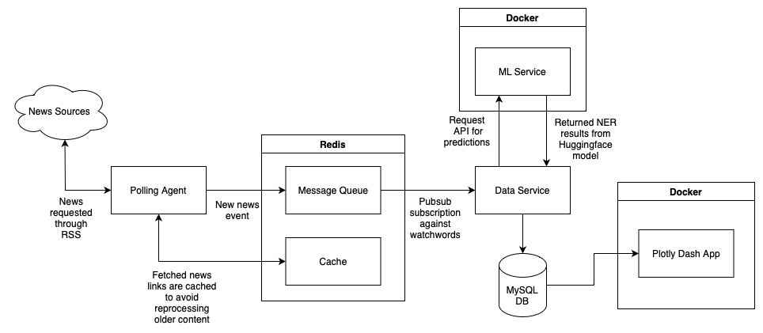

# Safestat
Safestat is an app that keeps tabs on certain crime keywords on news platforms, and provides statistics about crime occurrances at different locations.

The app itself is broken down into multiple services.
1. Polling Agent: periodically fetches news from various RSS feeds configured by the user and maintains a cache to ensure non-duplicate processing - user is free to add sources and watchwords
2. Data Service: picks up new news events from a message queue, gets predictions from the ML service and puts the processed data in the DB storage
3. ML Service: a containerized serving of a NER (named-entity-recognition) NLP model that extracts and returns locations from news text
4. Database: a MySQL database server storing events
5. Dashboard Service: a containerized dashboard serving app built using Plotly Dash, displaying analytics about news and various watchwords

# Setup
View the setup.md for instructions on how to set up the app for first use